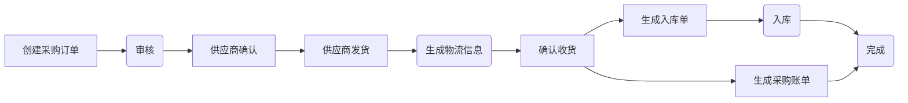
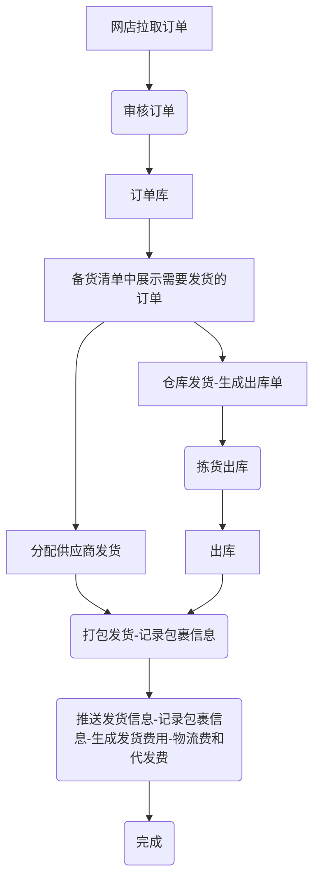
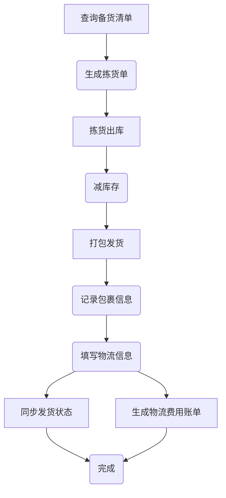
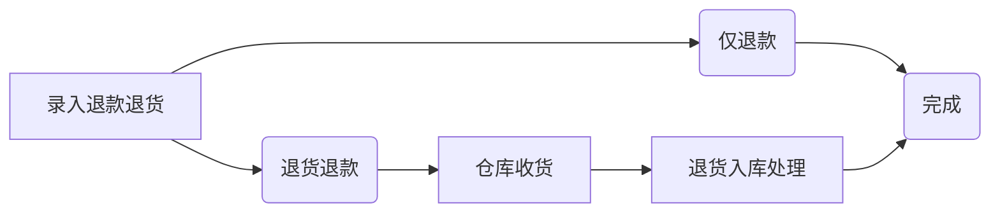
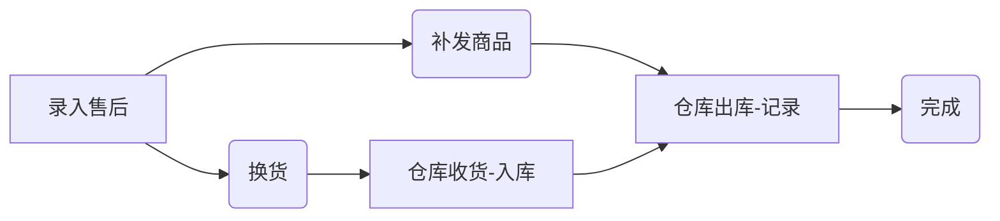
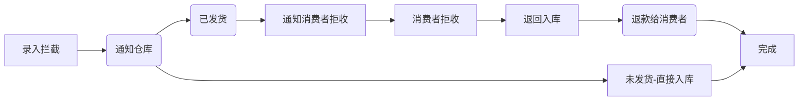

# 启航电商ERP系统
## 一、系统介绍
启航电商ERP系统是一套为电商企业构建的一套简单、实用、现代化UI的覆盖全流程的电商系统，本项目采用Java SpringBoot3+Vue2前后端分离开发。 该系统建立在企业使用基础上删减了一些个性化功能，基本满足电商业务处理。

启航电商ERP系统主要场景是：订单发货、售后处理与库存出入库联动，支持货品先入先出。出入库都有详细的记录，适合电商企业业务处理和财务对账，可以很方便地二次开发加入财务对账模块或者通过接口与财务系统进行对接。

**支持供应商一件代发和仓库发货两种发货方式**

### 1.1 功能介绍

+ 采购管理：采购下单、采购入库、采购退货出库等。

+ 订单管理：支持手动添加订单，**支持网店订单API拉取**，目前支持的平台有：淘宝、京东、拼多多、抖店、视频号小店，后续计划继续支持快手、小红书等。

+ 发货管理：支持分配给仓库发货和分配给供应商发货，**后续计划引入OMS系统的电子面单打印功能**。

+ 售后管理：支持手动添加售后单，**支持网店售后API拉取**。售后处理反馈（订单拦截、订单补发、订单退货、订单换货、订单退款等）。

+ 库存管理：仓库管理，仓库出入库明细管理。

+ 店铺管理：网店管理、网店参数设置、网店商品关联（**支持网店商品API拉取**）。

+ 商品管理：商品管理、商品属性管理、商品分类管理。

+ 系统设置：登录用户设置、系统设置等。

### 1.2 主要技术及组件
+ Java17
+ SpringBoot3
+ Redis
+ Nacos
+ MyBatis-Plus
+ MySQL8

### 1.3 开发计划
+ [ ] 引入OMS系统中的电子面单打印，实现打单发货一体。
+ [ ] 对接更多电商平台API
  + [x] 淘宝
  + [x] 京东
  + [x] 拼多多
  + [x] 抖店
  + [x] 微信视频号
  + [ ] 快手小店
  + [ ] 小红书

## 二、主要流程
**启航电商ERP可以说是我多年电商行业从业经验积累的成果。**

公司从2019年踏入电商以来，一直都是由我组建和带领一帮技术人员从零开始建设了一套完全适应公司业务需要的电商ERP系统，包括WMS仓库系统、OMS订单处理系统、财务系统、直播运营系统等子系统组成。核心模块包括：采购模块、出入库模块、订单发货模块、电子面单打印模块等。

公司ERP对接了批批网、1688、蘑菇街、淘宝、拼多多、抖店、快手小店平台。

### 2.1 采购流程
+ 采购单管理：管理采购流程，包括供应商选择、采购单生成、采购单审核等。
+ 采购物流管理：跟踪采购订单物流信息。
+ 采购账单管理
+ 供应商管理：管理供应商信息

**采购流程**

### 2.2 发货流程

**订单发货流程**

**仓库发货流程**

### 2.3 售后处理流程

**退货退款流程**

**售后流程**

**订单拦截**

## 三、部署说明

**项目采用SpringBoot+vue2开发。具体使用方法如下**

#### 3.1 配置启动MySQL

+ 创建数据库`qihang-erp`
  + 1、导入数据库结构：sql脚本`docs\qihang-erp.sql`
  + 2、导入系统数据：sql脚本`docs\qihang-erp-sys.sql`

#### 3.2 启动Redis
项目开发采用Redis7

#### 3.3 启动后端api

+ 修改`api`项目中的配置文件`application.yml`配置`Mysql`相关配置。

+ 启动项目

#### 3.4 启动前端 `vue`
+ `npm install`
+ `npm run dev`
+ 打包`npm run build:prod`
+ 访问web
  + 访问地址：`http://localhost`
  + 登录名：`admin`
  + 登录密码：`admin123`

## 四、期待您的支持

**感谢大家的关注与支持！希望利用本人从事电商10余年的经验帮助到大家提升工作效率！**

💖 如果觉得有用记得点 Star⭐

### 4.1 关注公众号

更多服务，请关注作者微信公众号：qihangerp168

💖 欢迎一起交流！ 

### 4.2 捐助项目
作者为兼职做开源,平时还需要工作,如果帮到了您可以请作者吃个盒饭

