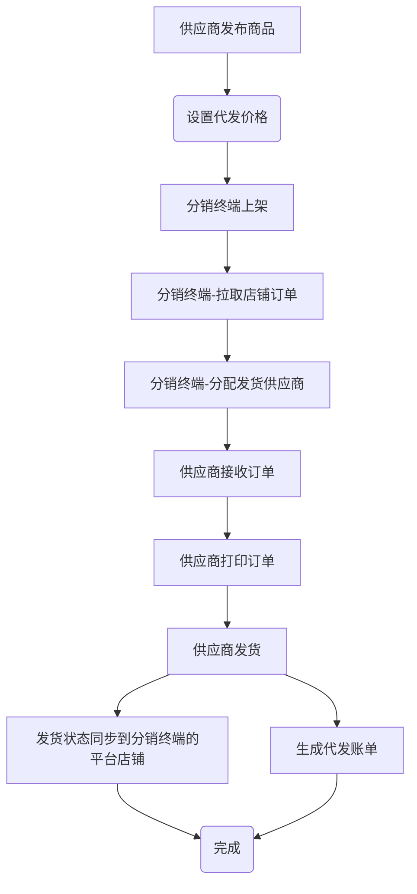

# 启航电商SCM供应链分销代发系统

## 一、项目概述

启航电商SCM供应链分销代发系统是为电商供应链端开发的一套供应商分销代发业务系统，主体业务流程是：分销终端从各平台店铺导入(拉取)订单、厂家(供应商)从系统后台打单发货。

系统由2个子系统组成：厂家(供应商)分销代发系统和分销终端订单管理系统。

+ `厂家(供应商)分销代发系统`主要功能：
  + 商品发布、价格设置
  + 订单打印
  + 订单发货
  + 售后处理
  + 代发应收账单

+ `分销终端订单管理系统`功能有：
  + 店铺管理
  + 店铺订单同步、
  + 订单分发给供应商
  + 店铺售后管理
  + 店铺商品上下架管理
  + 代发应付账单

本系统后端采用Dubbo微服务架构，前端采用Vue2+Element。

系统使用者有：厂家(供应商)、分销终端(各店铺经营者)。

**系统主干流程：**

## 二、项目说明
**本项目后端采用Dubbo微服务开发，前端采用vue+element**

### 2.1 主要版本
+ 后端：
  + `Java`: 17
  + `SpringBoot`: 3.0.13
  + `Dubbo`：3.2.12
+ 前端：
  + `vue2`
  + `elementUI`

### 2.2 存储及中间件
+ `MySQL`:数据库,版本8.x。
+ `minio文`:文件存储,用于图片存储。
+ `Redis`:在线用户信息、缓存。
+ `Nacos`:版本2.2.0以上，配置中心、注册中心。

### 2.3 项目结构
#### 2.3.1 api-scm
`厂家(供应商)分销代发系统`接口项目，端口8080，采用dubbo调用其他微服务。

#### 2.3.2 api-oms
`分销终端订单管理系统`接口项目，端口8081，采用dubbo调用其他微服务。

#### 2.3.3 interfaces
微服务接口类库（包括domain、service-interface）

#### 2.3.4 service
微服务实现层，service-impl

#### 2.3.5 common
公共类库

#### 2.3.6 vue-scm
`厂家(供应商)分销代发系统`前端Vue项目，调用`api-scm`项目接口

#### 2.3.7 vue-oms
`分销终端订单管理系统`前端Vue项目，调用`api-oms`项目接口

## 三、如何使用？
### 3.1、开发环境配置
+ MySQL数据库创建
  + 运行MySQL脚本`docs\sql\qihangerp-scm.sql`导入数据到主库`qihangerp-scm`

+ 启动nacos
  + 启动
  
    **一般情况下：下载nacos2.3.2解压之后直接运行：**
  
    `startup.cmd -m standalone`
 
  + 添加Nacos配置
    + 项目dataId`qihangerp-scm.yaml`（配置内容从docs\qihangerp-scm.yaml复制即可）

+ 启动Redis

  
+ 启动minio

  
### 3.2、启动后端

+ 启动`service`下面的所有微服务
+ 启动`api-scm`项目
+ 启动`api-dcm`项目

### 3.3、启动前端 `vue-scm`、`vue-dcm`
+ `npm install`
+ `npm run dev`
+ 打包`npm run build:prod`
+ 访问web
  + 访问地址：`http://localhost`
  + 登录名：`admin`
  + 登录密码：`admin123`

## 四、期待您的支持

**感谢大家的关注与支持！希望利用本人从事电商10余年的经验帮助到大家提升工作效率！**

💖 如果觉得有用记得点 Star⭐

### 4.1 关注公众号

更多服务，请关注作者微信公众号：qihangerp168

💖 欢迎一起交流！

### 4.2 捐助项目
作者为兼职做开源,平时还需要工作,如果帮到了您可以请作者吃个盒饭

