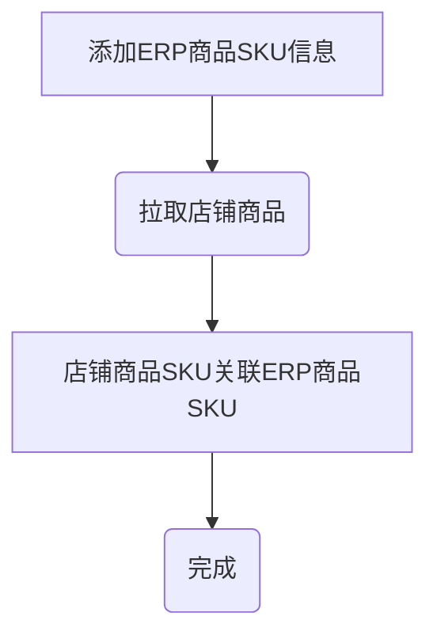
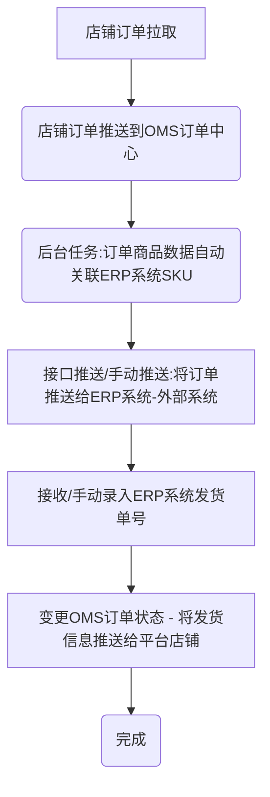
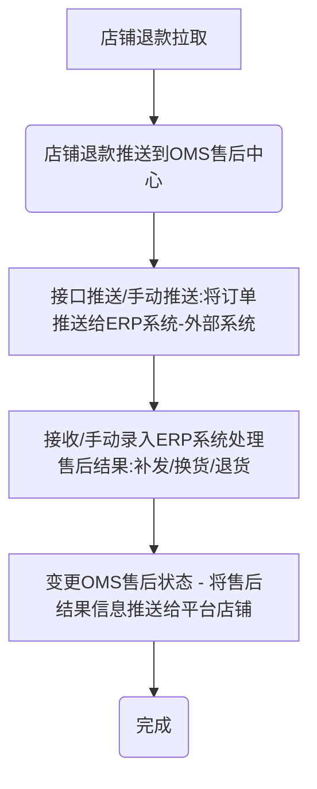
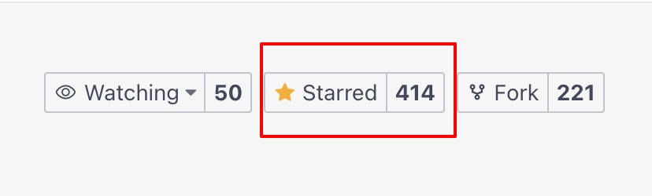

# 启航电商OMS订单处理系统

## 一、系统介绍

启航电商OMS订单处理系统支持多平台多店铺订单、售后、商品等管理，目前已接入：淘宝、京东、拼多多、抖店、微信小店，后续会继续接入快手小店、小红书等。

主体功能包括：
+ 订单管理：店铺订单同步、管理。
+ 发货管理：电子面单打印、发货记录、物流跟踪等。
+ 售后管理：店铺售后同步、售后处理（补发、换货、退货处理）等。
+ 店铺管理：店铺管理、店铺商品管理（拉取店铺商品、ERP关联）。

**基本上覆盖了电商网店管理日常业务，可使用接口对接内部ERP系统。**

**订单打单（电子面单打印）已支持：淘宝、京东、拼多多、抖店、微信小店**

本项目采用SpringCloudAlibaba微服务架构+Vue2+Element开发。


## 二、关键流程

### 2.1 关联商品SKU



### 2.2 处理订单（发货）



### 2.3 处理售后




## 三、功能模块

### 1、订单管理
+ 从平台同步订单
+ 订单发货
  + 获取订单收货地址信息
  + 推送物流信息到平台
+ 订单备注修改

### 2、发货管理
+ 电子面单打印
+ 订单发货

### 3、售后管理
+ 从平台同步售后列表
+ 售后处理（同意、备注）


### 4、店铺管理
+ 从平台同步商品信息
+ 关联ERP sku

**支持多店铺管理**


## 四、软件架构
### 1、开发环境级组件
#### 1.1 开发环境
+ Jdk：17
+ Nodejs：v16.20.0

#### 1.2、存储及中间件

+ MySQL8
+ Redis：7.x
+ Kafka(消息队列)
+ Nacos：2.2.0（配置中心、注册中心）
+ Sentinel（分布式流量治理组件）


### 2、项目结构
#### 2.1 公共版本
+`common`
项目公共模块

+ `security`
公共权限验证模块

+ `goods`
商品模块
#### 2.2 微服务
+ `gateway`
网关项目，负责微服务接口转发，前端统一通过网关调用其他微服务接口；

采用`gateway`进行api分发，引入Sentinel进行流量治理。

+ `sys-api`
项目系统微服务，主要功能包括：

+ 用户
+ 菜单

+ `oms-api`
oms主功能微服务，主要功能包括：

+ 队列消息处理（订单消息、退款消息）
+ 订单接口
+ 退款接口
+ 店铺接口

+ `open-api`
各开放平台微服务

+ 淘宝开放平台接口api


+ 京东开放平台接口api


+ 抖店开放平台接口api


+ 拼多多开放平台接口api


+ 微信小店开放平台接口api


+ 快手小店开放平台接口api


### 3、运行说明
#### 3.1、启动环境

1. 启动MySQL8

2. 启动Redis7

3. 启动Sentinel1.8.7控制台(可以不需要)
   `java -Dserver.port=8888 -Dcsp.sentinel.dashboard.server=localhost:8888 -Dproject.name=sentinel-dashboard -jar sentinel-dashboard.jar`
4. 启动Nacos（注册中心）

5. 启动Kafka（消息队列）
`启动KRaft模式kafka`
   + 0 进入kafka解压目录
   + 1 生成UUID`bin\windows\kafka-storage.bat random-uuid`
   + 2 格式化`bin\windows\kafka-storage.bat format -t ujpyXZx-S9-jGlwxgORmow -c config\kraft\server.properties`
   + 3 启动`bin\windows\kafka-server-start.bat config\kraft\server.properties`

#### 3.2、导入数据库
+ 创建数据库`qihang-oms`
  + 导入数据库结构：sql脚本`docs\qihang-oms.sql`


#### 3.3、启动服务(项目)
1.  启动开放平台微服务（`open-api`）
2.  启动`sys-api`、`oms-api`微服务
3.  启动微服务网关（`gateway`）

#### 3.4、运行前端
+ Nodejs版本：v16.20.0
+ 进入`vue`文件夹
+ 运行`npm install` 
+ 运行`npm run dev`
+ 浏览网页`http://localhost:88`

### 4、项目部署

#### 4.1 打包

##### 后端打包
`mvn clean package`

##### 前端打包
`pnpm run build:prod`


#### 4.2 Nginx配置
```
# 上传文件至远程服务器
将打包生成在 `dist` 目录下的文件拷贝至 `/usr/share/nginx/html` 目录

# nginx.cofig 配置（主要是配置接口转发）
server {
	listen     88;
	server_name  localhost;
	location / {
			root /usr/share/nginx/html;
			index index.html index.htm;
	}
	# 反向代理配置
	location /prod-api/ {
			proxy_pass http://127.0.0.1:8088/; # 替换成你的后端网关API地址
	}
}
```

## 四、一起交流

**感谢大家的关注与支持！希望利用本人从事电商10余年的经验帮助到大家提升工作效率！**

### 4.1 赠人玫瑰手留余香
💖 如果觉得有用记得点 Star⭐


### 4.2 加入知识星球一起交流

💖 欢迎加入知识星期获得作者帮助和朋友们一起交流！


### 4.3 捐助作者
作者为兼职做开源,平时还需要工作,如果帮到了您可以请作者吃个盒饭


### 4.4 获取授权与服务

[如何获取授权与服务](https://mp.weixin.qq.com/s/mATn2nfc5bUePohS_s2WGw)


