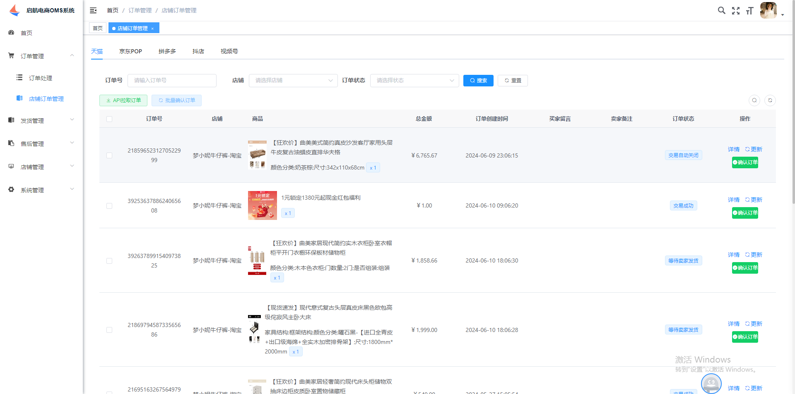
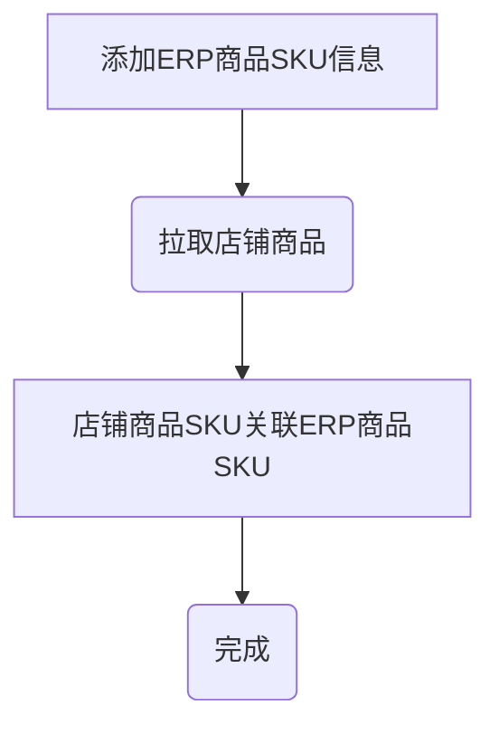
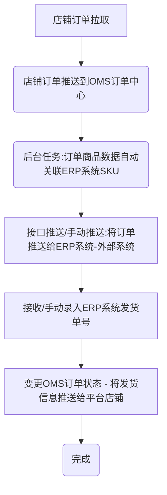
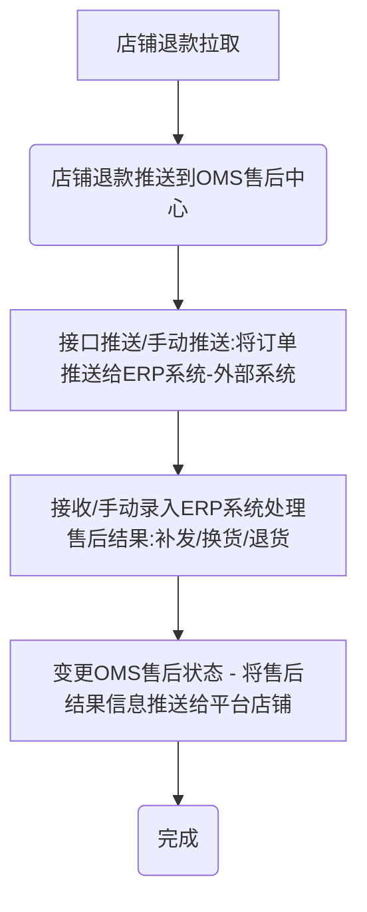

# 启航电商OMS订单处理系统

## 一、系统介绍

启航电商OMS订单处理系统支持多平台多店铺订单、售后、商品等管理，目前已接入：淘宝、京东、拼多多、抖店视频号，后续会继续接入快手小店、小红书等。

主体功能包括：
+ 订单管理：店铺订单同步、管理。
+ 发货管理：电子面单打印、发货记录、物流跟踪等。
+ 售后管理：店铺售后同步、售后处理（补发、换货、退货处理）等。
+ 店铺管理：店铺管理、店铺商品管理（拉取店铺商品、ERP关联）。

**基本上覆盖了电商网店管理日常业务，可使用接口对接内部ERP系统。**

**订单打单（电子面单打印）功能正在开发中**

本项目采用SpringCloudAlibaba微服务架构+Vue2+Element开发。




## 二、关键流程

### 2.1 关联商品SKU



### 2.2 处理订单（发货）



### 2.3 处理售后




## 三、功能模块

### 1、订单管理
+ 从平台同步订单
+ 订单发货
  + 获取订单收货地址信息
  + 推送物流信息到平台
+ 订单备注修改

### 2、发货管理
+ 电子面单打印
+ 订单发货

### 3、售后管理
+ 从平台同步售后列表
+ 售后处理（同意、备注）


### 4、店铺管理
+ 从平台同步商品信息
+ 关联ERP sku

**支持多店铺管理**


## 四、软件架构
### 1、开发环境级组件
#### 1.1 开发环境
+ Jdk：17
+ Nodejs：v16.20.0

#### 1.2 项目组件
##### 后端核心组件
+ SpringBoot：3.0.2
  + spring-boot-starter-security
+ SpringCloudAlibaba：2022.0.0.0
  + Nacos
  + SpringCloud Gateway
  + spring-cloud-starter-loadbalancer

##### 前端框架及组件
+ vue2
+ element

#### 1.3、存储及中间件

+ MySQL8
+ Redis：7.x
+ Kafka
+ Nacos：2.2.0（配置中心、注册中心）
+ Sentinel（分布式流量治理组件）

  `java -Dserver.port=8888 -Dcsp.sentinel.dashboard.server=localhost:8888 -Dproject.name=sentinel-dashboard -jar sentinel-dashboard.jar`


### 2、项目结构
#### 2.1 core
项目公共模块包括：

+ `common`:公共类型

+ `security`:公共权限验证模块

#### 2.2 api
网关项目，负责微服务接口转发，前端统一通过网关调用其他微服务接口；

采用`gateway`进行api分发，引入Sentinel进行流量治理。

#### 2.3 sys-api
项目系统微服务，主要功能包括：

+ 用户
+ 菜单

#### 2.4 oms-api
oms主功能微服务，主要功能包括：

+ 队列消息处理（订单消息、退款消息）
+ 订单接口
+ 退款接口
+ 店铺接口

#### 2.5 open-api
各开放平台微服务
##### 2.5.1 tao-api
淘宝开放平台接口api

##### 2.5.2 jd-api
京东开放平台接口api

##### 2.5.3 dou-api
抖店开放平台接口api

##### 2.5.4 pdd-api
拼多多开放平台接口api

##### 2.5.5 wei-api
微信视频号小店开放平台接口api


##### 2.5.6 kwai-api
快手小店开放平台接口api


### 3、运行说明
#### 3.1、启动环境

1. 启动MySQL8
2. 启动Redis7
3. 启动Sentinel1.8.7控制台
4. 启动Nacos2.2.0
5. 启动Kafka

#### 3.2、导入数据库
+ 创建数据库`qihang-erp`
  + 1、导入数据库结构：sql脚本`docs\qihang-erp.sql`
  + 2、导入系统数据：sql脚本`docs\qihang-erp-sys.sql`

#### 3.3、启动服务(项目)
1.  启动开放平台业务微服务（tao-api、jd-api、dou-api、pdd-api等平台接口api微服务）
2.  启动sys-api、oms-api微服务
3.  启动微服务网关（api）

#### 3.4、运行前端
+ Nodejs版本：v16.20.0
+ 进入`vue`文件夹
+ 运行`npm install` 
+ 运行`npm run dev`
+ 浏览网页`http://localhost`

### 4、项目部署

#### 4.1 打包

##### 后端打包
`mvn clean package`

##### 前端打包
`pnpm run build:prod`


#### 4.2 Nginx配置
```
# 上传文件至远程服务器
将打包生成在 `dist` 目录下的文件拷贝至 `/usr/share/nginx/html` 目录

# nginx.cofig 配置
server {
	listen     80;
	server_name  localhost;
	location / {
			root /usr/share/nginx/html;
			index index.html index.htm;
	}
	# 反向代理配置
	location /prod-api/ {
			proxy_pass http://127.0.0.1:8080/; # 替换成你的后端网关API地址
	}
}
```


## 五、获取一键演示包

启航电商ERP系统自从开源以来，收到很多兄弟们的关注，也很多兄弟们想看演示效果，由于项目是非商业化的没有财力去支撑演示环境服务器，为了满足兄弟们想看系统演示，作者特地制作了一个一键演示包，获取之后直接在Windows电脑中即可运行。

[一键演示包获取地址](https://mp.weixin.qq.com/s?__biz=MjM5MTM1ODg0Mg==&mid=2447551448&idx=1&sn=53aab9a0123caf912cc89accb5fb226d&chksm=b2a0c1cd85d748dbde1eb7d511e3933d0ebd9df7d4e8f35e4d3eba7624ab5264f10900845b11&payreadticket=HKl0eiGUReMt0NYHRj2hUZS-ANiV_oN0p8XIfKxeIqVs2ZdYE1Rts-9YlN7uXwEWnLcq2H4#rd)


## 六、支持作者

**感谢大家的关注与支持！希望利用本人从事电商10余年的经验帮助到大家提升工作效率！**

💖 如果觉得有用记得点 Star⭐


### 1、有偿服务
+ 提供部署服务
+ 提供演示包服务
+ 提供定制化开发服务
+ 提供系统培训服务
+ 提供版本商业化支持服务
+ 提供电商系统软著代申请服务（文档、源代码）
+ 提供电商平台appkey申请协助服务

### 2、更多服务

更多服务，请关注作者微信公众号：qihangerp168


💖 欢迎一起交流！

### 3、捐助支持
作者为兼职做开源,平时还需要工作,如果帮到了您可以请作者吃个盒饭


