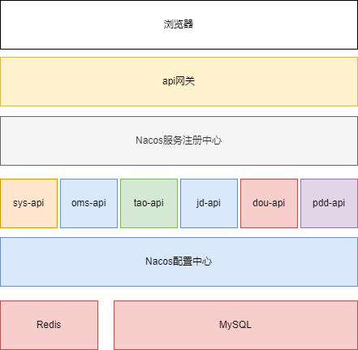
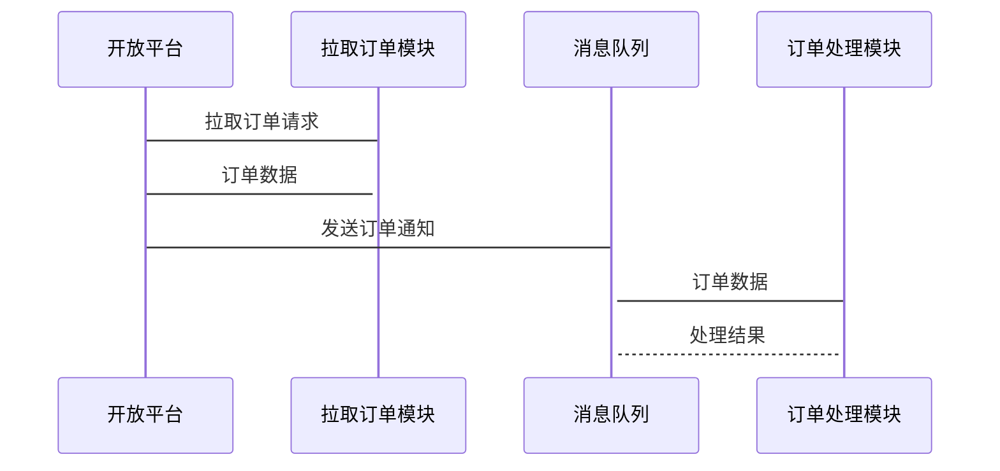
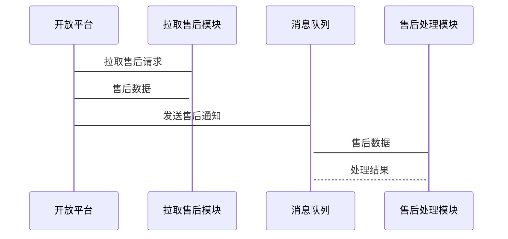
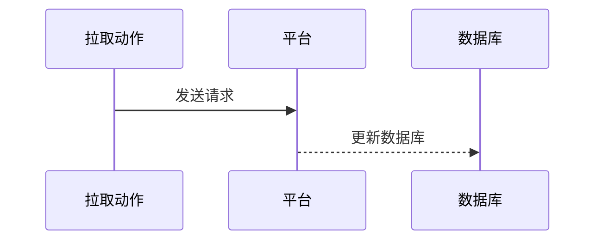
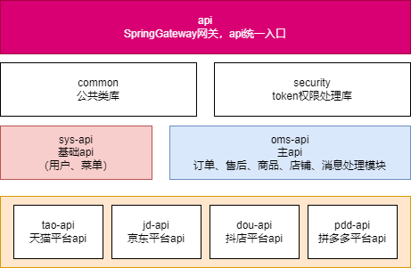

# 启航电商OMS系统架构设计说明书

&nbsp;&nbsp;

| 时间 | 版本  | 编写人 |备注 |
| --- |    --- | --- | --- |
| 2024-3-15 | 0.1 | 齐李平 |  |

&nbsp;&nbsp;

&nbsp;

## 一、引言

### 1.1 背景

本文档旨在介绍启航电商OMS系统的架构设计，为项目开发及维护提供指导。

&nbsp;

### 1.2 术语和缩略语

| 缩写 | 术语   |备注 |
| --- | --- | --- |
| OMS | 订单处理系统 | |
| 平台 | 指天猫、京东、抖店、拼多多 | |

&nbsp;

### 1.3 参考资料

暂无

&nbsp;

&nbsp;

&nbsp;

&nbsp;

&nbsp;

&nbsp;

&nbsp;

&nbsp;

&nbsp;

&nbsp;

## 二、功能设计

### 2.1 软件名称

`启航电商OMS系统`

### 2.2 软件功能

#### 2.2.1 订单管理
+ 订单搜索、查看
+ 平台订单拉取
+ 平台订单更新
+ 自动更新任务
+ 订单备注
+ 订单商品管理ERP商品
+ 订单发货

#### 2.2.2 售后管理
+ 售后搜索、查看
+ 售后单拉取
+ 售后单更新
+ 自动更新任务

#### 2.2.3 ERP商品管理
+ ERP商品查询（id、编码、标题、库存）
+ 添加ERP商品Sku（id、编码）
+ 批量导入

#### 2.2.4 店铺管理
+ 店铺查询
+ 店铺参数设置
+ 店铺商品管理
	+ 店铺商品搜索
	+ 店铺商品管理ERP商品
	+ 店铺商品拉取、更新
+ 店铺其他参数
	+ 快递公司库（分平台）
	+ 快递地址库（分平台）

### 2.3 软件应用

该软件适用于电商平台订单管理、售后管理，包括：订单同步、订单发货、售后同步、商品同步等。

### 2.4 需求边界

该软件不包含：订单打印、仓库进销存相关功能；

## 三、架构设计
### 3.1 架构设计目标和约束
#### 3.1.1 运行环境

| 序号 | 项目  | 详细 |
| --- |    --- | --- | 
| 1 | 后台接口环境 | Linux、Jdk17、MySQL8、Redis、Nacos2.2.0 |
| 2 | 前端环境 | Nginx |

#### 3.1.2 开发环境

| 序号 | 项目  | 详细 |
| --- |    --- | --- | 
| 1 | 操作系统 | Windows 10 |
| 2 | 编译系统 | Jdk17、nodejs20 |
| 3 | 编程语言 | Java、ts |
| 4 | 编程工具 | idea、vscode |
| 5 | 软件环境 | MySQL8、Redis、Nacos2.2.0 |

#### 3.1.3 开发框架及组件

| 序号 | 项目  | 框架 |  版本 |
| --- |    --- | --- | --- | 
| 1 | 容器 | SpringBoot | 3.0.2 | 
| 2 | 微服务架构 | SpringCloudAlibaba | 2022.0.0.0 |
| 3 | 注册组件 | Nacos | 2.2.0 |
| 3 | 缓存 | Redis | 7.x |
| 4 | 数据库 | MySQL | 8.x |
| 5 | 前端框架 | Vue | 3.x |
| 6 | 前端框架 | Element-Plus | 最新版 |

### 3.2 总体架构

### 3.3 核心流程
#### 3.3.1 订单拉取流程

#### 3.3.2 订单发货推送

#### 3.3.3 售后拉取

#### 3.3.4 商品拉取

### 3.4 项目结构

## 四、数据库设计

后续补充

## 五、部署
### 5.1 总体结构

